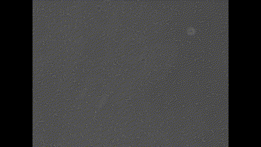
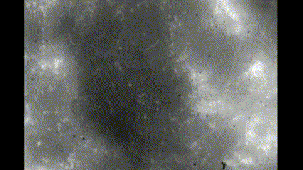

### Bacteria identification & tracking  
Algorithm for bacteria identification and tracking in videos for speed estimation using opencv in C++, this project is based on the YSMR algorithm [1] and the work in Machine learning-based motion tracking of [2].

### main.cpp
This file contains all the methods, initialization and set up of the video processing environment. It handles command-line arguments for video input and user preferences for display and tracking:

Execution parameters: 
*all should be provided
1. Videos path 
2. Video index (-1 for all)
3. Wait mode (0 - continuous play, 1 - wait until pressed key)
4. Show tracks (0 false 1 true)

Required libraries:
- OpenCV:
 

With the main project in the path "local_path" of the system, the execution only requires to call for the "Makefile" as:

    $cd local_path/BacteriaTracking
    $make
    $./BacteriaTracking param_1 param_2 param_3 param_4

### Video resources
The video resources used for testing and development are available in the "videos" folder. These are used to demonstrate the functionality of the bacteria identification and tracking algorithm. The original resources like Bacillus subtilis can be found at [1], while Leptospira interrogans belongs to [2].

#### Bacillus subtilis

#### Leptospira interrogans

### References
[1] S. J., O. I., D. J y et al., “YSMR: a video tracking and analysis program for bacterial motility.,” BMC
Bioinformatics 21, 166 (2020), 2020. doi: 10.1186/s12859-020-3495-9.

[2] A. K., K. N. y N. Sl, “Machine learning-based motion tracking reveals an inverse correlation between
adhesivity and surface motility of the leptospirosis spirochete.,” Nat Commun 14, 7703 (2023), 2023. doi:
10.1038/s41467-023-43366-0.

    
